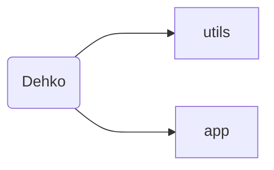

# Dehko


Dehko is a multi-OS NLP smart assistant tool built to easily automate non-developer and developer tasks. Dehko allows you to eliminate the baggage of inflexible syntax/semantics that are involved with the other usual forms of automation (scripts, macros, niche applications, settings, etc). 

Dehko allows you to define custom sequences by defining a command and associated keyphrases that correspond to that command. Moreover, there’s no need to worry about remembering these keyphrases. Dehko uses NLP to parse, evaluate, and classify your input, ensuring that the process of converting natural, human language into understandable instructions is highly accurate. 

Dehko is highly customizable yet simple to use. All modifications are handled by simply editing a single JSON configuration file, and constant streams of open source analytic tools are available to users to view. Here’s a video that better illustrates what Dehko does and how it works. 


## Installation

Clone this repository within the directory of your choice. After cloning the repository, install the following either manually or through `requirements.txt` which is located under `Dehko/utils`. 

- Docker 
- Tensorflow 2.0. `$ pip install tensorflow`
- Pandas. `$ pip install pandas` 
- NLTK. `$ pip install ntlk`
- Matplotlib, Jupyter, Pandas, SciPy, NumPy. `$ python3 -m pip install --user numpy scipy matplotlib ipython jupyter pandas sympy nose`

To ensure that Dehko was installed correctly, type the command `docker run dehko --version` to check whether or not Dehko installed correctly. Currently, Dehko is on version 1.02. All that’s remaining before you get Dekho up and running for your usage is to modify the JSON configuration file and then type in the command `dehko train`. More details about modifying Dekho to fit your needs are located in the customization section.


## Customization 
To customize Dehko – such as defining a custom command and associated phrases – there are two steps to it. 

The first step would be to modify the primary JSON configuration file. This is located under the the directory `Dehko/utils` would be to modify a JSON file “config.json.” The purpose of this step is to inform Dehko what new commands are being added and the associated phrases for that command. Currently, Dehko comes with 3 default commands. Copy the layout of one of these and modify the fields appropriately. 

The second step is to actually define the sequence for Dehko to execute once the command is matched. Dehko is primarily built on Python, which allows for powerful scripting capabilities. To define a new script associated with the entry just added within the JSON file, it’s recommended to create a new Python file with the code that should be executed for that command. Then within the file, “commands to mapping” dictionary, add the function that you define within the dictionary.

Here’s a complete example of adding a new command named “Web Workflow” that will open Google Chrome when Dehko classifies the command as such. Let’s begin by modifying the JSON file. Here is what the new entry would look like:

```json
{
 {
  command: "Web-Workflow", 
  phrases: ["open web workflow", "open tabs", "web workflow", "workflow"]
 }
}
```

Then, we need to actually write the code to be executed whenever the “Web Workflow” command is classified. First let’s create a new Python file with the name “web-workflow-action.py.” Then within that file, let’s add the following content within that file: 

```python
import subprocess

def web-workflow(workflow_number):

	# If the workflow number is one, then we will Open firefox
	if workflow_number == 1: 
		subprocess.call(['C:\Program Files\Mozilla Firefox\\firefox.exe'])
		return 

	# If it is anything else, we will execute Google Chrome
	subprocess.call(['C:\Program Files\Google Chrome\\chrome.exe'])	
```

After making any modifications to Dehko, it needs to be retrained. To re-optimize Dehko and run the command just created, we would use the following code: 
```console

foo@bar:~$ dehko train
>
> Dehko is Cleaning and Re-Optimizing!
> Progress: [30%] [##########---------------------------]
>
> Dehko is now ready!
>
foo@bar:~$ dehko open workflow ~1
> Task Complete.
```


## Directory Structure 



