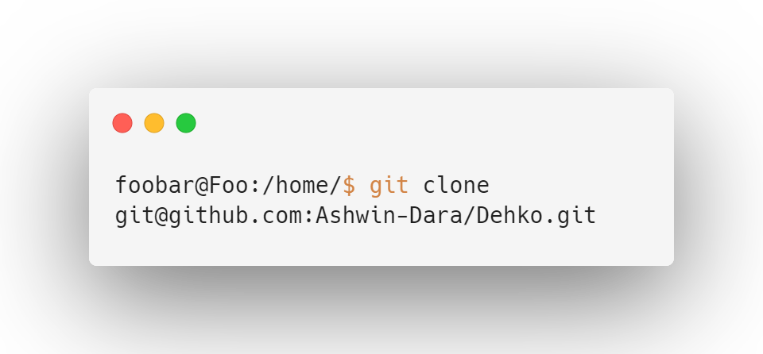
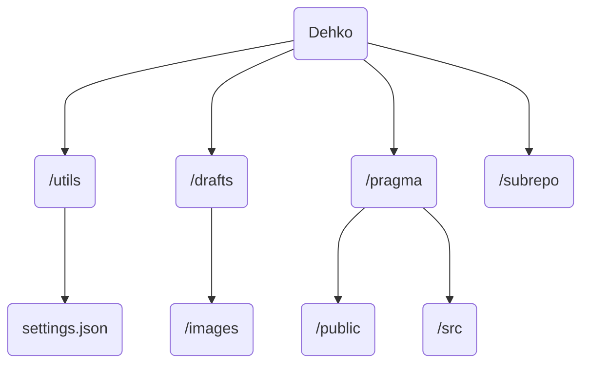

# Dehko💡- The NLP Automation Assistant


  

Dehko is a multi-OS NLP smart assistant tool built to easily automate non-developer and developer tasks. Dehko allows you to eliminate the baggage of inflexible syntax/semantics that are involved with the other usual forms of automation (scripts, macros, niche applications, settings, etc). 

Dehko allows you to define custom sequences by defining a command and associated keyphrases that correspond to that command. Moreover, there’s no need to worry about remembering these keyphrases. Dehko uses NLP to parse, evaluate, and classify your input, ensuring that the process of converting natural, human language into understandable instructions is highly accurate. 

Dehko is highly customizable yet simple to use. All modifications are handled by simply editing a single JSON configuration file, and relevant metadeta will be displayed everytime any scripts are run to help provide clarity in what's happening under the hood. 


## Installation

There are two forms of installations. The first option, which gives more persmissions to Dehko to make modifications to your computer (), would be using virtual environments. The second is through downloading the containerized version of Dehko by pulling the Docker image from Docker hub. The tradeoff between these two is that the first option allows for scripts that potentially involve opening applications on your host computer. Moreover, the first method is significantly less resource intensive on your computer. 

### Installation via "venv"

First clone this repository using the following command into your specified directory. 

```bash 
foobar@Foo:/home/$ git clone git@github.com:Ashwin-Dara/Dehko.git
```



Afterwards, cd into the directory "/Dehko/utils/venv/Scripts" through the following set of commands. 

```bash 
foobar@Foo:/home/$ cd Dehko/utils/venv/Scripts 
```
Before proceeding ensure that venv is installed on your system. For directions on how to install venv, please check this reference: https://pypi.org/project/virtualenv/. 

After this, activate the virtual environment. For machines based on Windows, the command is `activate.bat`, which will execute the appropriate .bat script. For unix-based machines (all other machines), activate the virtual environment through the following command. 
```bash 
foobar@Foo:/home/Dehko/utils/venv/Scripts$ source activate
```
After this command you will notice a changed prefix in your current working directory displayed in the terminal. This means that the environment has been activated. For double measures, run the following command to ensure that all dependencies are successfully installed within your virtual environment. 

```bash
(/home/Dehko/utils/Scriptsfoobarutils.1env) foobar@Foo:/home/Dehko/utils/venv/Scripts$ pip3 install -r ../requirements.txt
```

After doing this, Dehko is ready to use! For potentially making this process more streamlined, consider a single bash script with an activation command of your choice. 

### Installation via Docker Hub

First ensure that Docker is installed on your system. Afterwards, pull the Docker image for Dehko from Docker hub using the following command. 

```bash
foobar@Foo:/home/$ docker pull 3415266/dehko
```
This will pull the Docker image of Dehko. Afterwards, build the image using the following command within the appropriate directory: 
```bash 
foobar@Foo:/home/$ docker build -t 3415266/dehko .
```
Dehko should be now ready to run! To ensure, run the container and Dehko's help flag using `docker run 3415266/dehko "--help"`. For the sake of speed and convenience, the first installation method is strongly preferred. 

## Customization and Usage
To customize Dehko – such as defining a custom command and associated phrases – there are two steps to it. 

The first step would be to modify the primary JSON configuration file. This is located under the the directory `Dehko/utils` would be to modify a JSON file "settings.json.” The purpose of this step is to inform Dehko what new commands are being added and the associated phrases for that command. Currently, Dehko comes with 3 default commands. Copy the layout of one of these and modify the fields appropriately. 

The second step is to actually define the sequence for Dehko to execute once the command is matched. Dehko is primarily built on Python, which allows for powerful scripting capabilities. To define a new script associated with the entry just added within the JSON file, it’s recommended to create a new Python file with the code that should be executed for that command. Then within the file, “commands to mapping” dictionary, add the function that you define within the dictionary.

Here’s a complete example of adding a new command named “Web Workflow” that will open Google Chrome when Dehko classifies the command as such. Let’s begin by modifying the JSON file. Here is what the new entry would look like:

```json
{
 {
  command: "Web-Workflow", 
  phrases: ["open web workflow", "open tabs", "web workflow", "workflow"]
 }
}
```

Then, we need to actually write the code to be executed whenever the “Web Workflow” command is classified. First let’s create a new Python file with the name “web-workflow-action.py.” Then within that file, let’s add the following content within that file: 

```python
import subprocess

def web-workflow(workflow_number):

	# If the workflow number is one, then we will Open firefox
	if workflow_number == 1: 
		subprocess.call(['C:\Program Files\Mozilla Firefox\\firefox.exe'])
		return 

	# If it is anything else, we will execute Google Chrome
	subprocess.call(['C:\Program Files\Google Chrome\\chrome.exe'])	
```

After making any modifications to Dehko, it needs to be retrained. To re-optimize Dehko and run the command just created, we would use the following code: 
```console

foo@bar:~$python3 ../../CLIParser.py train
Dehko (1.02)

Retraining Dehko to reflect updates made in settings.json & enhance classification accuracy!

Optimizing Neural Network: |████████████████████████████████| 50/50

Epoch 1/350
1/1 [==============================] - 4s 4s/step - loss: 3.2184 - accuracy: 0.0400
Epoch 2/350
1/1 [==============================] - 0s 14ms/step - loss: 3.2176 - accuracy: 0.0400
Epoch 3/350
1/1 [==============================] - 0s 10ms/step - loss: 3.2168 - accuracy: 0.0400
...
...
...
Epoch 348/350
1/1 [==============================] - 0s 12ms/step - loss: 0.3920 - accuracy: 1.0000
Epoch 349/350
1/1 [==============================] - 0s 11ms/step - loss: 0.3893 - accuracy: 1.0000
Epoch 350/350
1/1 [==============================] - 0s 12ms/step - loss: 0.3867 - accuracy: 1.0000

foo@bar:~$ python3 ../../CLIParser.py "open web workflow ~1"
Dehko 1.02
Executing Scripts |
1/1 [==============================] - 1s 522ms/step


Message Parser Details
Description of Command: `open web workflow ~1`. Argument[s] Detected: `1`
Task Completed! Executed the script associated with the procedure: web-workflow.
```

## Directory Structure
Here is a overview of the directory structure, highlighting the most important directories and the most relevant files. 



Folders
- utils - contains all of the logic of Dehko, written in Python. Also contains the dependencies list in requirements.txt.
- drafts - contains all images used within this project. 
- pragma - folder containing the react application
- subrepo - any external utilities for particular functionality 

Files 
- settings.json - this configuration file is what will be modified in order to customize the functionality of Dehko up to the client needs. This is one of the most important files in terms of ensuring that Dehko functions as intended.

-----

### Resources
- https://www.tensorflow.org/guide/keras/rnn
- https://www.nltk.org/api/nltk.tokenize.html
- https://www.techtarget.com/searchitoperations/definition/Docker-image
- https://blog.keras.io/building-powerful-image-classification-models-using-very-little-data.html
- https://docs.python.org/3/tutorial/venv.html
- https://readthedocs.org/projects/argparse/